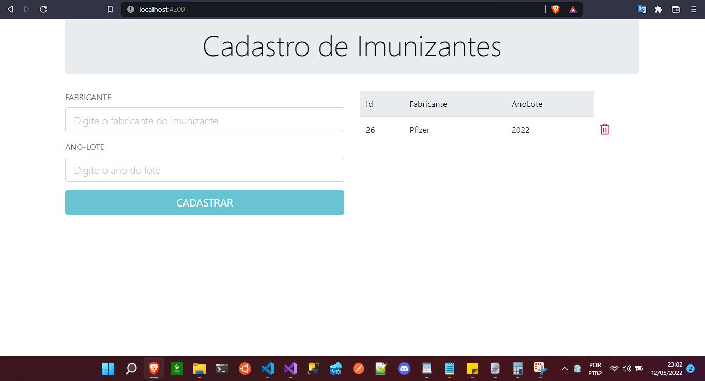

# Cadastro de Imunizantes

  

## Descrição
Essa aplicação tem como objetivo simular um formulário de cadastro de imunizantes onde é possível inserir, consultar, alterar e excluir registros dos imunizantes, onde os mesmos devem ser da Pfizer ou SINOVAC e com lote superior ao ano de 2020.

## Tecnologias Utilizadas
* C#
* Web API
* Angular 11
* SQLite
* Entity Framework Core
* MsTest

## Como executar
1. Faça o download ou clone este repositório;
2. Abra-o arquivo CadastroImunizante.sln no Visual Studio
3. Faça um rebuild para que sejam importadas corretamente as dependências do projeto
4. Na pasta raiz vá em CadImunologico.WebApp e abra a pasta no VSCode
5. Ao abrir o Projeto Angular no VSCode, abra o terminal e dê um npm install para baixar as dependências e em seguida dê um npm start
6. Acesse no browser o endereço http://localhost:4200/
